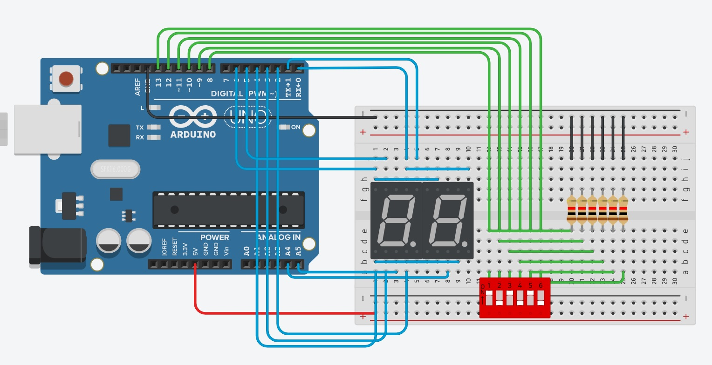

<script type="text/javascript" charset="utf-8" 
src="https://cdn.mathjax.org/mathjax/latest/MathJax.js?config=TeX-AMS-MML_HTMLorMML,
https://vincenttam.github.io/javascripts/MathJaxLocal.js"></script>

# Binary
---

## Problema
---
Estamos acostumbrados a usar la base decimal como sistema numérico, es decir, es un sistema que tiene 10 dígitos (0 al 9). En informática, es normal hablar de la base `binaria` o `hexadecimal` (0 al 1 y 0 a F respectivamente). En esta oportunidad, vamos a pensar un poco en el sistema binario y tratar de hacer un programa que transforme un número binario en uno decimal.

Para empezar, podemos pensar en el sistema binario como una serie de llaves que están encendidos (1) o apagados (0). Como el sistema decimal, cada dígito tiene un peso, por ejemplo:

$$
123 = 100 + 20 + 3 = 1 x 10^2 + 2 x 10^1 + 3 x 10^0
$$

Lo mismo ocurre en el sistema binario, por ejemplo:

$$
13 = 8 + 4 + 1 = 2^3 + 2^2 + 2^0 = 1101
$$

Noten que escribimos el número como suma de potencias de dos y decir que esas potencias de dos 'están' con un 1 o 'no están' con un 0, en el ejemplo de arriba, el 0 representa que falta la potencia de 1. Toma un tiempo acostumbrarse a pensar de esta manera, pero podemos escribir cualquier número de esta forma.

El programa que vamos a escribir, va a ir a un microcontrolador, que va a tomar como entrada una serie de llaves que representen los unos y ceros y luego tratar de convertir esa serie de unos y cero en un número decimal.

## Donde empezar
---
Dentro de la carpeta `pset3/binary` clonen la rama `pset3/binary` del repositorio `ise4` donde van a encontrarse con las bases del algoritmo que van a tener que desarrollar. Para clonarlo, escriban en la terminal:

```
git clone -b pset3/binary https://github.com/trq20/ise4.git
```

Dentro de la carpeta que se va a clonar, van a ver un `binary.ino`. 

## Entendiendo el programa
---
Los pines que van a usar son los que ven en unos arrays al comienzo del programa, luego les daremos detalles de como conectarlos.

La función `display` la creamos nosotros para que puedan mostrar un dígito en el display 7 segmentos sin preocuparse demasiado en como funciona. Toma un parámetro de entrada que es el numero que quieren escribir (siempre y cuando este entre 0 y 9) y lo muestra.

## Circuito y simulación
---
Entren a [tinkercad](https://www.tinkercad.com/) y elijan la opción para crear un nuevo circuito. A continuación, les mostramos los componentes que van a tener que conectar y usar:

| Pin Arduino | Conexión                                 |
| ----------- | ---------------------------------------- |
| 0~6         | A~G de ambos 7 segmentos respectivamente |
| 18          | Ánodo común del primer 7 segmentos       |
| 19          | Ánodo común del segundo 7 segmentos      |
| 8~13        | Conmutadores DIP x 6                     |

Pueden ver como queda el circuito abajo:



**Nota:** Los 7 segmentos son *ánodo común. Respeten especialmente como están conectados.

Vayan a la opción de *Código > Texto* y ahí pueden pegar el programa que clonaron para comenzar a programar. Cuando estén listos, pueden simular el programa y ver como se comporta.

## Especificaciones
---
El algoritmo que diseñen tiene que ser capaz de:
- Mostrar el valor binario que representan los conmutadores como un valor decimal en los display 7 segmentos.
- Mostrar de manera fluida ambos dígitos, probablemente necesiten un delay pequeño para lograrlo.

## Orientación
---

[](LINK A VIDEO)

- Con seis conmutadores, podemos representar en binario hasta el numero `63`, van a tener que encontrar la forma de separar la decena de la unidad para mostrarlos cada uno en su display.
- El operador `%` devuelve el *resto* de una división entre dos números. Por ejemplo, `5 % 2 = 1`.
- Recuerden que si hacen una división y el resultado lo guardan en una variable del tipo `int`, los decimales desaparecen y solo queda la parte entera.
- Como los 7 segmentos comparten pines, si escriben un numero con la función `display` el resultado será que ambos displays van a mostrar el mismo numero, por eso hay que asegurarse de apagar el que no queremos para que no se muestre. Eso pueden controlarlo con los pines conectados a los ánodos de cada display, enviando un `LOW`, apagan ese display en particular, con un `HIGH` lo prenden.
- La función `pinMode` elige si un pin es `INPUT` o `OUTPUT`, toma como parámetros el número de pin y luego el modo.
- La función `digitalWrite` escribe un valor en un pin que este configurado como salida. Toma como parámetros el número de pin y luego el valor de la salida que puede ser `HIGH` o `LOW`.
- La función `delay` les permite generar un retardo en el programa. Como parámetro escriben el valor en `milisegundos` que quieren que demore.

## Como probar el código
---
Pueden probar las siguientes combinaciones:
- Con todos los conmutadores abajo, deben ver un `00`.
- Con el 2, 4 y 6 arriba, deben ver un `42`.
- Con el 1, 3 y 5 arriba, deben ver un `21`.
- Con todos los conmutadores arriba, deben ver un `63`.

## Como entregar
---
Una vez que su programa este andando, pueden descargar el programa desde el `tinkercad` y guárdenlo con el nombre de `binary.ino` dentro de la carpeta `pset3/binary`.

Dentro de la carpeta `pset3/binary` abrir la terminal y escribir `git init`. Luego, crear un archivo dentro de la carpeta que se llame `README.md`. El archivo debe tener este contenido:

```markdown
# Binary

Alumno: Nombre y apellido
Curso: Curso
Materia: Control de Interfaces

[Imagen del circuito]
```

Pueden agregar cualquier comentario u observación adicional que crean que pueda ser útil dentro de este archivo.

En la terminal ahora corran los comandos:

```
git add binary.ino README.md
git commit -m "Initial commit"
git checkout -b ise4/2021/gpio/binary
```

Por ultimo, hacer un push de la rama que recién crearon al repositorio en GitHub con:

```
git push https://github.com/trq20/USERNAME.git ise4/2021/gpio/binary
```

Recuerden cambiar `USERNAME` por su nombre de usuario en GitHub. Pueden verificar si la entrega se hizo visitando el repositorio en `https://github.com/trq20/USERNAME/tree/ise4/2021/gpio/binary`. Si al entrar al link no encuentran nada, vuelvan a verificar los pasos de esta sección.

