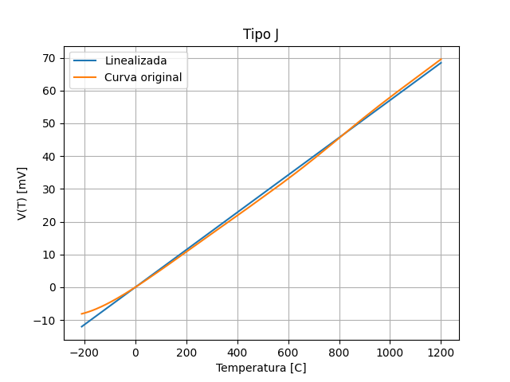

<script type="text/javascript" charset="utf-8" 
src="https://cdn.mathjax.org/mathjax/latest/MathJax.js?config=TeX-AMS-MML_HTMLorMML,
https://vincenttam.github.io/javascripts/MathJaxLocal.js"></script>

# Termocupla
---

## Problema
---
Las termocuplas son transductores de temperatura utilizados ampliamente en industrias. Tienen algunas ventajas respecto a los que hasta ahora venimos trabajando, particularmente en lo que respecta a rango de temperatura (varias superan los 1000 grados centígrados) y que no necesitan alimentación. Si tienen una desventaja en cuanto a su precisión, como ya van a notar.

Básicamente una termocupla es dos metales distintos unidos en una juntura que entra en contacto con lo que queremos medir. Al cambiar la temperatura de la juntura, aparece el denominado [efecto Seebeck](https://es.wikipedia.org/wiki/Efecto_termoel%C3%A9ctrico) que produce una diferencia de potencial pequeña dependiendo de la temperatura aplicada.

El propósito de esta actividad, es que vean algunas particularidades que tenemos que tener en cuenta a la hora de trabajar con elementos como una termocupla.

Nos tomamos el trabajo de resolver un par de cosas por ustedes primero. Una de ellas, es que la respuesta de la termocupla no es lineal, como en el caso del `NTC`, pero esta vez, tampoco hay una fórmula que responda al gráfico. Para solucionarlo, tomamos un `.csv` (un archivo de Excel pero separado con comas) que tiene el valor de tensión que entrega la termocupla (en este caso es una termocupla tipo J) para cada valor de temperatura. Con un programa de Python, tomamos esos datos y obtuvimos una curva linealizada:



Noten que hay dos curvas, la naranja es la que responde a los datos que nos da el fabricante y la azul, es una aproximación lineal que nos va a permitir hacer las cuentas en el microcontrolador de forma mas sencilla. Por supuesto, esta aproximación va a introducir error al resultado, pero nos da una primera buena idea de lo que estamos midiendo.

El valor de la pendiente de la recta azul es de `57.07 uV/C` que vamos a usar mas adelante en nuestro código. Como pueden ver, las tensiones que entrega la termocupla son muy pequeñas, por lo que vamos a necesitar de alguna forma amplificarlas para que puedan ser apreciables.

## Donde empezar
---
Dentro de la carpeta `pset1/termocupla` clonen la rama `pset1/termocupla` del repositorio `ise5` donde van a encontrarse con las bases del algoritmo que van a tener que desarrollar. Para clonarlo, escriban en la terminal:

```
git clone -b pset1/termocupla https://github.com/trq20/ise5.git
```

Además de la plantilla de código, esta vez les estamos dando el circuito en Proteus ya diseñado. Lo hicimos porque el diseño involucra usar algunos dispositivos electrónicos que todavía no conocen. El trabajo de ustedes, es observar el circuito, descubrir algunos parámetros y poder armar el código que lea correctamente la temperatura de la termocupla.

## Entendiendo el programa
---
Lo único que tienen esta vez en el `main.cpp` es una constante definida que es la pendiente de la que hablábamos antes. Hay una constante mas que van a tener que descubrir que es propia del circuito, pero el resto es muy similar al trabajo que ya venían haciendo.

## Entendiendo el circuito
---
Pueden ver que el circuito ya esta diseñado. Van a notar unos cuantos elementos nuevos:

- `TC1` es la termocupla que vamos a medir.
- `U2` es un amplificador operacional configurado como un `sumador`.
- `U3` es un amplificador operacional configurado como `inversor` con ganancia 1.
- Las resistencias conectadas a ambos operacionales son las que definen la ganancia.

Dijimos que le operacional U2 es un sumador. Literalmente lo que hace es tomar la tensión que entrega la termocupla y la suma con la que entrega el divisor de tensión entre `RA` y `RB`, aunque, antes de sumarlas, las amplifica de acuerdo al valor de las resistencias `RF1`, `R1` y `R2`. Pueden pensar en la tensión de salida de este amplificador como:

$$
v_o = - \Bigg(\frac{R_{F_1}}{R_1}v_1 + \frac{R_{F_1}}{R_2}v_2\Bigg)
$$

Donde `v1` es la tensión de la termocupla y `v2` es la del divisor de tensión. El signo negativo que aparece es porque el amplificador no solo suma, sino que invierte, por eso, tenemos el segundo operacional que se encarga de volver a invertir la tensión con ganancia 1 (no modifica su valor) para que tengamos una tensión positiva para medir.

Noten que entonces la suma no es directa, sino que depende del valor de las resistencias. A nuestro microcontrolador llega la suma de esas dos tensiones, por lo que su tarea es descubrir las ganancias de ambas tensiones involucradas y obtener la que corresponde a la termocupla, junto con la temperatura que está midiendo. 

Pueden obtener las ganancias calculándolas o pueden medir individualmente cada tensión (desconectando la otra) y observando los voltímetros para calcular la ganancia, sabiendo que la ganancia se calcula como:

$$
A_v = \frac{v_o}{v_i}
$$

Si se preguntan por que esta el divisor de tensión, es porque hay una zona de temperatura en la que la termocupla entrega tensión negativa, lo que no podemos tener, entonces para solucionarlo, le sumamos un pequeño nivel de tensión para compensarlo.

## Especificaciones
---
El programa que desarrollen debe:
- Mostrar en la primer fila del LCD la tensión que entrega la termocupla en mV.
- Mostrar en la segunda file del LCD la temperatura que está midiendo la termocupla en grados C.

## Orientación
---

[](LINK A VIDEO)

- Pueden mirar esta [página](https://www.notion.so/Librer-as-153c030dc4874e12a9fbd75a49dd08a0) para entender mejor como funcionan las librerías y que funciones pueden usar.  
- Recuerden que el valor que reciban de la función `analogRead` es un número entero que es proporcional a la temperatura, pero necesita que le hagan una conversión. Pueden pensarlo así:

```c
uint16_t val = analogRead(0);			   // Devuelve un numero entre 0 y 1023
float tension = (float)val * REF / 1023;	// Valor de tension que en el pin
```

Esto puede hacerse de forma mas compacta, pero la idea es que tenemos que hacer la lectura, luego convertirla a tensión con la relación de la segunda linea (donde `REF` es el valor de tensión de referencia que elegimos). 

- Recuerden que pueden fijar una tensión de referencia mas apropiada para mejorar la precisión de la medición si arman un divisor de tensión y conectan esa tensión al pin `AREF` del microcontrolador.

- La tensión que mide el microcontrolador es la suma de dos tensiones, cada una amplificada por cierta ganancia. No se olviden de quitar la parte del divisor de tensión en los cálculos antes de buscar la de la termocupla.

## Como probar el código
---
Una vez que terminen el programa, vayan a la terminal, asegúrense de que esta apunte a la carpeta donde están trabajando y escriban `make -f makefile.mk`. Si todo está en orden, tienen que ver este mensaje:

```
$ make -f makefile.mk
avr-gcc -Wall -g -Os -mmcu=atmega328p -DF_CPU=1000000 -I. -o termocupla.bin main.cpp libs/analog.cpp libs/LCD.cpp libs/digital.cpp -lm
avr-objcopy -j .text -j .data -O ihex termocupla.bin termocupla.hex
```

Y luego, van a ver que algunos archivos nuevos van a aparecer, uno de ellos es el `termocupla.hex`, este contiene la traducción de nuestro código a instrucciones en hexadecimal que vamos a grabar en la flash del microcontrolador.

En el Proteus, vayan a las propiedades del microcontrolador y en *Program file* carguen el `termocupla.hex`. Luego den inicio a la simulación con el botón en la esquina inferior izquierda.

## Como entregar
---
Dentro de la carpeta `pset1/termistor` abrir la terminal y escribir `git init`. Luego, crear un archivo dentro de la carpeta que se llame `README.md`. El archivo debe tener este contenido:

```markdown
# Termocupla

Alumno: Nombre y apellido
Curso: Curso
Materia: Adquisicion de Datos

```

Pueden agregar cualquier comentario u observación adicional que crean que pueda ser útil dentro de este archivo.

En la terminal ahora corran los comandos:

```
git add .
git commit -m "Initial commit"
git checkout -b ise5/2021/temperatura/termocupla
```

Por ultimo, hacer un push de la rama que recién crearon al repositorio en GitHub con:

```
git push https://github.com/trq20/USERNAME.git ise5/2021/temperatura/termocupla
```

Recuerden cambiar `USERNAME` por su nombre de usuario en GitHub. Pueden verificar si la entrega se hizo visitando el repositorio en `https://github.com/trq20/USERNAME/tree/ise5/2021/temperatura/termocupla`. Si al entrar al link no encuentran nada, vuelvan a verificar los pasos de esta sección.

