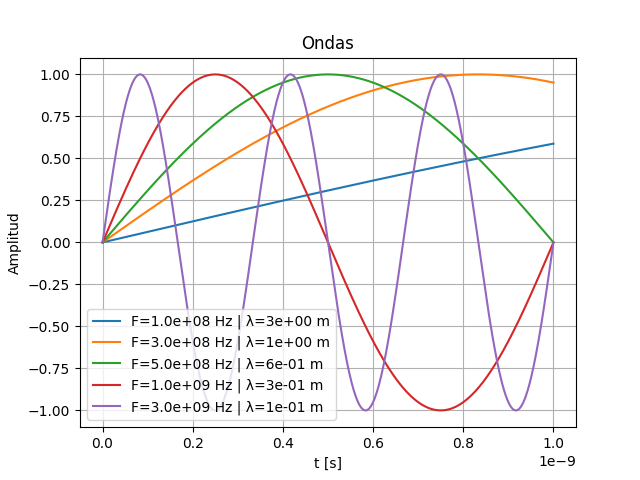

<script type="text/javascript" charset="utf-8" 
src="https://cdn.mathjax.org/mathjax/latest/MathJax.js?config=TeX-AMS-MML_HTMLorMML,
https://vincenttam.github.io/javascripts/MathJaxLocal.js"></script>

# Ondas
---

### Formula
---

$$
\lambda = \frac{C}{f} \space con \space C = 3 \times 10^{8} \frac{m}{s}
$$

**Nota**: La fórmula usa la velocidad de propagación en vez de la velocidad de la luz (C), pero como en la mayoría de los casos trabajamos con ondas electromagnéticas que se propagan en el espacio libre, usamos C, si eso no es así, se va a aclarar. 

## Resolver
---
### La longitud de onda de una onda con:

- 1 s de período.
- 3 GHz de frecuencia.

### La frecuencia de una onda con:
- 3 mm de longitud de onda.
- 15 us de período.

### El período de una onda con:
- 9 Km de longitud de onda.
- 10 KHz de frecuencia.

Lo que resuelvan, lo van a escribir en un `README.md` escribiendo las ecuaciones en un lenguaje que se llama `LaTeX`. 

## Graficar
---
Dentro de la carpeta `pset1/ondas` clonen del repositorio `teleco1` una plantilla de código para resolver esta parte. Para clonarlo, escriban:

```
git clone -b pset1/ondas https://github.com/trq20/teleco1.git
```

Van a encontrarse con un `ondas.py` con bastante código ya escrito. Entre las cosas que tiene, van a encontrarse con una lista de frecuencias para las que van a tener que graficar la onda correspondiente en un rango de tiempo determinado. En el gráfico tiene que aparecer una leyenda indicando la frecuencia y la longitud de onda de la onda en particular. 

Lo que hagan tiene que quedar parecido a esto:



## Orientación
---
- Pueden encontrar una referencia al lenguaje `LaTeX` en esta [página](https://en.wikibooks.org/wiki/LaTeX/Mathematics).
- Como GitHub no renderiza bien las ecuaciones en `Markdown`, vamos a tener que usar una herramienta adicional para que se vean bien en el repositorio. En vez de escribir las fórmulas entre `$$ $$`, van a escribir esto en su lugar:

```html

```

Y reemplazan lo que viene después de `math=` por la fórmula que quieran.

- El método `plt.plot()` sirve para graficar una serie de puntos. Hay un ejemplo en el programa.
- Pueden encontrar ayuda para darle formato al string que usen como label para el gráfico en esta [página](https://www.w3schools.com/python/ref_string_format.asp).
- Recuerden que una onda se describe como:

$$
f_{(t)}=A sin(2\pi f t)
$$
Donde: A es la amplitud (pueden usar 1), f es la frecuencia y t es el tiempo en el que se calcula la onda.

- Van a necesitar algún tipo de bucle para recorrer la lista que tiene los valores de t donde van a analizar la onda. Hay muchas formas de hacerlos en Python, algunas mas eficientes que otras. Pueden ver algunos ejemplos en esta [página](https://www.w3schools.com/python/python_for_loops.asp).

## Como entregar
---
Dentro de la carpeta `pset1/ondas` abrir la terminal y escribir `git init`. Luego, crear un archivo dentro de la carpeta que se llame `README.md`. El archivo debe tener este contenido:

```markdown
# Ondas

Alumno: Nombre y apellido
Curso: Curso
Materia: Telecomunicaciones I

## Resoluciones
[Todas las cuentas que hayan hecho]

## Gráfico
[Imagen del gráfico que les haya quedado]
```

Pueden agregar cualquier comentario u observación adicional que crean que pueda ser útil dentro de este archivo.

En la terminal ahora corran los comandos:

```
git add .
git commit -m "Initial commit"
git checkout -b teleco1/2021/intro/ondas
```

Por ultimo, hacer un push de la rama que recién crearon al repositorio en GitHub con:

```
git push https://github.com/trq20/USERNAME.git teleco1/2021/intro/ondas
```

Recuerden cambiar `USERNAME` por su nombre de usuario en GitHub. Pueden verificar si la entrega se hizo visitando el repositorio en `https://github.com/trq20/USERNAME/tree/teleco1/2021/intro/ondas`. Si al entrar al link no encuentran nada, vuelvan a verificar los pasos de esta sección.