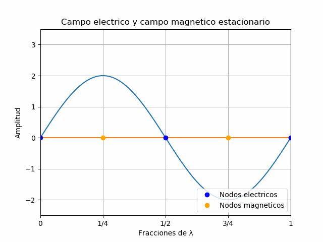

# Ondas estacionarias
---
# Concepto de onda estacionaria
---
Con lo que sabemos hasta ahora de ondas electromagnéticas, supongamos la siguiente situación: Tenemos una onda EM que está viajando en dirección -x (a la que llamaremos `onda incidente`). Esta onda tiene sus campos eléctrico y magnético en los ejes y, z respectivamente.

En situaciones ideales, la onda continuaría propagándose indefinidamente. Pero pensemos ahora en lo que ocurriría si ponemos un plano conductor en el plano yz (perpendicular al eje x). Esto es lo que se denomina una condición de frontera. Eventualmente, la onda chocará con el plano y no podrá continuar propagándose. La pregunta que ahora surge es ¿qué ocurrirá con la onda? 

La onda no tendrá mas opción que volver y provocando que aparezca una nueva onda (a la que llamaremos `onda reflejada`) con las mismas magnitudes de campo que comenzará a propagarse en sentido contrario a la onda incidente.

Mientras esta nueva onda está viajando en dirección +x, todavía tenemos nuestra primer onda que está viajando en dirección -x.  Ambas ondas entonces van a encontrarse, y debido a que tienen características similares (misma frecuencia) interferirán entre sí sumándose o restándose según la fase en la que se encuentren.

El resultado de esto, es que aparecerá una tercer onda a la que llamaremos `onda estacionaria`. El nombre es debido a que no se propaga, sino que siempre se encuentra en el mismo lugar. Vean la siguiente simulación para darse una idea:

Imaginen que estamos viendo lo que ocurre con uno solo de los campos para simplificar el análisis. Vean que hay una onda naranja propagándose hacia la izquierda (-x) que será la onda incidente. La onda azul propagándose hacia la derecha (+x) será la reflejada. 

La tercer onda que mencionamos, la estacionaria, es la verde. Observen que es una suma punto a punto de las otras dos. Esta onda estacionaria alcanza su máxima amplitud cuando las anteriores están en fase y equivale al doble de la amplitud de la onda incidente o reflejada. Su mínima amplitud cuando se encuentras desfasadas 180 grados.

El otro detalle que se puede observar, es que la onda estacionaria no se mueve. Crece y decrece, pero está siempre en el mismo lugar. De hecho, vean que hay tres puntos marcados como `nodos`, que son los puntos en donde la onda estacionaria se hace cero. Los puntos máximos son llamados `antinodos` y vean que tampoco se mueven de donde están. De estas características viene el nombre de estacionaria. Noten que los nodos y antinodos se repiten cada 1/2 λ.

Entendiendo ahora un poco mejor lo que es una onda estacionaria, veamos si podemos intentar deducir como será la de una onda electromagnética. Habíamos dicho que el limite o la terminación en la que va a incidir nuestra primer onda era un plano conductor. Por las características que tienen los conductores, un campo eléctrico no puede existir de forma paralela al conductor (como es el caso de nuestro campo eléctrico incidente). Por ese motivo, el campo eléctrico reflejado será tal que se pueda tener siempre un campo eléctrico resultante nulo en el plano conductor (habrá un nodo de la onda estacionaria en ese plano). Por lo que, si la onda incidente entra al plano conductor con un campo eléctrico de valor determinado, el de la reflejada siempre será opuesto.

En cuanto al campo magnético, no tiene esta limitación al entrar en el plano conductor. De hecho, el hecho de que deba generarse un campo eléctrico nulo en ese punto va a provocar corrientes que inducirán un campo magnético. Por esa razón, el campo en el conductor no va a ser nulo, va a ser un máximo, o sea, un antinodo.

Si uno expresara todo esto en una ecuación para cada campo, obtendría lo siguiente:

$$
\vec{E_y}(x,t) = -2E_{max}sin(kx)sin(\omega t)
$$

$$
\vec{B_z}(x,t)=-B_{max}cos(kx)cos(\omega t)
$$

El desarrollo de estas ecuaciones no se va a hacer aquí, va a quedar en el apéndice de esta sección, simplemente presentamos las ecuaciones y destacamos que:

- El campo eléctrico responde a una forma senoidal.
- En la posición x=0 (en el conductor) el campo eléctrico sera cero.
- El campo magnético responde a una forma cosenoidal.
- En la posición x=0 (en el conductor) el campo magnético será máximo.
- En ambos casos, la amplitud máxima del campo será el doble del campo original.

# Planos nodales y antinodales
---
Vamos a intentar comparar la onda estacionaria del campo eléctrico y el magnético. Si bien necesitaríamos verlo en un gráfico tridimensional, lo haremos en uno de dos dimensiones para simplificar el análisis. Miren la siguiente animación:

No se graficaron las ondas incidentes y reflejadas para simplificar el gráfico, pero la incidente estaría viajando hacia la izquierda hasta encontrarse con un plano conductor en x = 0.

La onda azul representa el campo eléctrico estacionario y la naranja el magnético. Noten que están desfasadas, por lo que los nodos y antinodos no coinciden como cuando la onda EM viajaba sin reflejarse. De hecho, un nodo del campo eléctrico es un antinodo en el magnético y viceversa.

Lo que se puede observar también, es que tanto nodo como antinodo tienen un intervalo de repetición de 1/2 λ, mientras que un nodo se convierte en un antinodo en 1/4 λ y viceversa.

Intentemos ver si podemos determinar de manera general donde se encuentran estos puntos.

En el caso del campo eléctrico, la secuencia de nodos viene:

$$
0, \cfrac{1}{2} \lambda, \lambda,\cfrac{3}{2}\lambda, 2\lambda...
$$

Por lo que podemos deducir que los planos nodales en el campo eléctrico ocurren cada:

$$
\cfrac{n}{2}\lambda, n \in \Z
$$

En el caso de los antinodos, la secuencia es:

$$
\cfrac{1}{4}\lambda,\cfrac{3}{4}\lambda,\cfrac{5}{4}\lambda,\cfrac{7}{4}\lambda...
$$

De manera general:

$$
\Bigg( \cfrac{n}{2} + \cfrac{1}{4} \Bigg) \lambda,n \in \Z
$$

Mientras que en el caso del campo magnético, es al revés que como describimos recién.

Noten que el numero n es un número entero, nunca puede ser fraccionario, los nodos y antinodos se repiten en fracciones enteras de medio λ.

Una aclaración: si bien hablamos de nodos y antinodos como un punto, en la realidad tenemos planos nodales y planos antinodales. Estos son el plano en donde el vector del campo se hace nulo o máximo. Pero el concepto es el mismo.

# Ondas en una cavidad
---
Por último, analicemos lo que ocurre si agregamos ahora un segundo plano conductor a una distancia L del primero y paralelo al mismo. Por un lado, sabemos que ambos conductores tienen que ser planos nodales para el campo eléctrico. Si eso no ocurre, no puede existir la onda estacionaria. Por ese motivo, L tendrá que ser un múltiplo de λ/2, por lo que solo habrá ciertas longitudes de onda que satisfagan esa condición, tal que:

$$
{\lambda}_n = \cfrac {2L}{n}, n \in \Z
$$

Mientras que las frecuencias que cumplen con esa condición serán:

$$
f_n = \cfrac{c}{{\lambda}_n}=n \cfrac{c}{2L}
$$

Con esta información y midiendo las posiciones nodales, podemos calcular la frecuencia que esta oscilando dentro de la cavidad. Noten que hay una frecuencia mínima (n=1) para la cavidad y, a partir de ahí las frecuencias son múltiplos enteros de esa `frecuencia fundamental`. Esta frecuencia junto con todos los múltiplos enteros de ella son denominados `frecuencias armónicas`. 

En esta animación solamente contamos con el campo eléctrico para simplificarlo. Noten que la onda azul (la fundamental) es la mínima ya que por lo menos tiene que entrar media longitud de onda en esta cavidad. Esta onda es considerablemente más lenta que sus armónicas (n=2 y n=3). A partir de ahí, podemos seguir contando infinitas frecuencias superiores que puedan entrar en esta cavidad, siempre y cuando cumplan con la condición de que en los planos conductores el campo eléctrico sea cero.

No solo los planos conductores reflejan ondas EM y permiten que se generen ondas estacionarias. Un aislante podría generar un efecto similar aunque con otro patrón de onda estacionaria. Pero por ahora nos basta con entender lo que ocurre cuando estas fronteras son planos conductores.