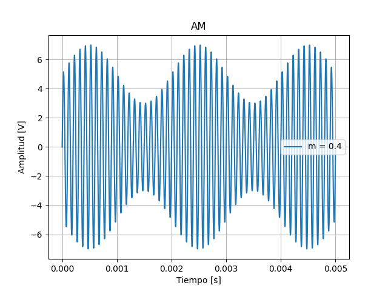

<script type="text/javascript" charset="utf-8" 
src="https://cdn.mathjax.org/mathjax/latest/MathJax.js?config=TeX-AMS-MML_HTMLorMML,
https://vincenttam.github.io/javascripts/MathJaxLocal.js"></script>

# Modulación
---

## Contexto
---

Para comenzar a hacer un análisis de la modulación en AM, recordemos que las señales portadora y moduladora se pueden expresar como:

$$
E_c(t)= E_c sin(2\pi f_ct)
$$

$$
E_m(t)=E_m sin(2\pi f_mt)
$$

Donde:
- $E_c$ y $E_m$ son las amplitudes de la portadora y la moduladora respectivamente.
- $f_c$ y $f_m$ son las frecuencias de la portadora y la moduladora.

A partir de estas dos señales, podemos obtener la expresión de una onda de AM con la siguiente expresión:

$$
E_{AM}(t)= E_c sin(2\pi f_ct) + \frac{E_m}{2} sin[2 \pi (f_c-f_m)t] - \frac{E_m}{2} sin[2 \pi (f_c+f_m)t]
$$

La justificación de expresión pueden verla en este [apartado](../am-formula.md).

## Donde empezar
---
Dentro de la carpeta `pset1/introAM` clonen del repositorio `teleco2` la rama `pset1/intoAM`. Escriban en la terminal:

```
git clone -b pset1/modulacion https://github.com/trq20/teleco2.git
```

## Entendiendo el programa
---
Van a encontrar un `am.py` que va a contener algunas cosas ya hechas para que empiecen a trabajar. Si van hasta el final del script, van a ver una definición de una clase y unas llamadas a métodos que no nos van a interesar ahora, sepan que para lo único que están es para poder configurar una pequeña interfaz visual con el módulo `tkinter`. 

Si ejecutan el script, van a ver que se va a abrir una ventana con cuatro sliders y dos botones. Cada slider manipula el valor de una propiedad de la ecuación de AM que vimos más arriba. Esos valores van a pasarse a la función `graficar` en el momento que aprieten el botón graficar. La tarea de ustedes es tomar esa información en la función y graficar la onda de AM con los parámetros que digan los sliders.

Noten que la función en cuestión tiene cuatro argumentos que son `em`, `fm`, `ec` y `fc` para tensión y frecuencia de moduladora y portadora respectivamente. Lo único que les damos inicializado es la variable `time` que la serie de puntos para los que van a graficar la onda, en este caso en particular, van a graficarla entre 0 y 5ms.

## Especificaciones
---
La función graficar debe:
- Graficar correctamente cualquier onda de AM con los parámetros indicados por los sliders.
- Con cada gráfico, incluir una leyenda que indique el índice de modulación correspondiente.  

El gráfico debe quedar algo similar a esto:



En este caso, los parámetros son:
- `em` = 2V.
- `fm` = 500Hz.
- `ec` = 5V.
- `fc` = 10KHz.

## Orientación
---
- Pueden imprimir una leyenda asociada al gráfico con el argumento `label` en `plt.plot`.
- La constante $\pi$ pueden obtenerla de `np.pi`.
- Las funciones `seno` y `coseno` pueden usarlas como `np.sin` y `np.cos`.
- Recuerden que el índice de modulación se calcula como:
 
$$
m = \frac{E_m}{E_c}
$$

- Para mas ayuda sobre como insertar una variable en un string pueden visitar esta [página](https://www.w3schools.com/python/ref_string_format.asp).

## Como entregar
---
Dentro de la carpeta `pset1/modulacion` escriban en la consola `git init`. Luego, creen un archivo llamado `README.md`. El archivo debe tener lo siguiente:

```markdown
# Modulación AM

Alumno: Nombre y apellido
Curso: Curso
Materia: Telecomunicaciones II

## Gráfico
[Alguno de los gráficos que probaron]
```

Pueden agregar cualquier comentario u observación adicional que crean que pueda ser útil dentro de este archivo.

En la terminal ahora corran los comandos:

```
git add README.md am.py
git commit -m "Initial commit"
git checkout -b teleco2/2021/am/modulacion
```

Por ultimo, hacer un push de la rama que recién crearon al repositorio en GitHub con:

```
git push https://github.com/trq20/USERNAME.git teleco2/2021/am/modulacion
```

Recuerden cambiar `USERNAME` por su nombre de usuario en GitHub. Pueden verificar si la entrega se hizo visitando el repositorio en `https://github.com/trq20/USERNAME/tree/teleco2/2021/am/modulacion`. Si al entrar al link no encuentran nada, vuelvan a verificar los pasos de esta sección.