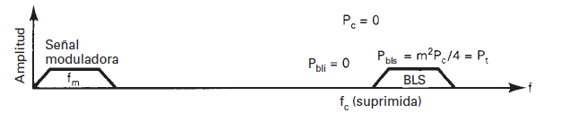

# Banda Lateral Única
---
Se le da este nombre a un tipo de modulación AM que solo posee una banda lateral. Dos de los problemas que tiene la AM convencional eran: la ineficiencia en cuanto al ancho de banda (transmite dos bandas laterales, duplicando innecesariamente la información); y la ineficiencia en cuanto a potencia ya que hasta casi toda se invierte en la portadora, que no es la información que queremos transmitir, sino el medio.

Existen varios tipos de BLU, entre ellos tenemos:

### SSBFC - Banda lateral única, portadora de máxima potencia

Esta busca reducir el ancho de banda usado. Arbitrariamente, se escoge una de las dos bandas y la otra se rechaza con un filtro.

De este modo, al tener solo una banda lateral, la potencia total queda expresada como:

$$
P_t = P_c \Big(1 + \cfrac{m^2}{4} \Big)
$$

En términos de rendimiento de potencia, es peor que la AM convencional, debido a que no logramos reducir la portadora y quitamos una de las bandas laterales. Es mejor en cuanto al ancho de banda, ya que usa solo la mitad. Lo bueno, es que necesitamos menos potencia para transmitir exactamente lo mismo que una AM convencional. Ejemplo, donde yo antes necesitaba 1,5KW para transmitir, ahora solo necesito 1KW.

### SSBRC - Banda lateral única, portadora reducida

Partiendo de la anterior, ahora lo que hacemos es reducir la amplitud de la portadora una vez que se haya hecho la modulación. Esto va a permitir que mucha mas potencia se invierta en la moduladora y que la transmisión sea mas eficiente.

Ahora la expresión de la potencia total nos queda:

$$
P_t = P_c \Big (0,01 + \cfrac{m^2}{4} \Big)  
$$

En este caso, la amplitud de la portadora se redujo al 10% luego de modular.

### SSBSC - Banda lateral única, portadora suprimida

En este caso, la portadora se suprime totalmente luego de la modulación. Esto nos va a permitir invertir el 100% de la potencia en la única moduladora, siendo el mas eficiente de los que se presentaron.

Ahora nos queda que la potencia total es:

$$
P_t = \cfrac{m^2}{4}
$$

Tanto este caso como el anterior, si bien son eficientes, son mucho mas costosos. Al no tener casi portadora, la sintonizaron en el receptor es mas compleja, teniendo que reinsertarla con un oscilador local.

### ISB - Banda lateral independiente

Esta es una transmisión de doble banda lateral conformada por dos modulaciones independientes de BLU con portadora reducida. Consiste en tener dos moduladores con la misma portadora común, uno produce la banda lateral superior y el otro la inferior, luego se combinan y producen una AM de doble banda lateral y portadora reducida.

La expresión de la potencia total nos queda:

$$
P_t = P_c \Big (0,01 + \cfrac{m^2}{2} \Big)
$$

Como en los dos casos anteriores, la portadora necesita ser reinsertada en el receptor.

## Rendimiento

En cuanto al rendimiento de cada uno de estos tipos de modulación, lo podemos medir como:

$$
\eta = \cfrac{Potencia \space útil}{Potencia total} = \cfrac{Potencia \space Banda/s \space Lateral/es}{Potencia \space total}
$$

El rendimiento en cada uno de estos casos, va a depender del índice de modulación con el que estemos trabajando. Mientras el índice de modulación sea mas alto, el rendimiento será mayor.

## Tabla resumen

| $AM$ | $P_{BL}$ | $P_t$ | $\Delta f$ |
| ---- | -------- | ----- | ---------- |
| DSBFC | $P_c\cfrac{m^2}{2}$ | $P_c \Big (1 + \cfrac{m^2}{2} \Big )$ | $2f_m$ |
| SSBFC | $P_c\cfrac{m^2}{4}$ | $P_c \Big (1 + \cfrac{m^2}{4} \Big )$ | $f_m$ |
| SSBRC | $P_c\cfrac{m^2}{4}$ | $P_c \Big (0,01 + \cfrac{m^2}{4} \Big )$ |$f_m$ |
| SSBSC | $P_c\cfrac{m^2}{4}$ | $P_c \cfrac{m^2}{4}$ |$f_m$ |
| ISB | $P_c\cfrac{m^2}{2}$ | $P_c \Big (0,01 + \cfrac{m^2}{2} \Big )$ | $2f_m$ |