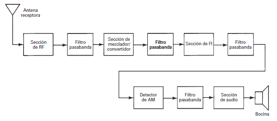
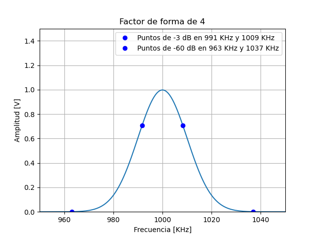

# Parámetros
---
La función de un receptor es convertir una señal de AM en la señal moduladora de nuevo. Esencialmente tiene etapas de detección y limitación de frecuencia, amplificación y demodulación.

Podríamos decir que un receptor se compone de los siguientes bloques:

Algunas de estas etapas, van a definir ciertas características que son importantes en los receptores.

## Selectividad
---
Tiene que ver con la capacidad del receptor de captar una banda de frecuencias en particular y rechazar las demás. La antena del receptor capta todas las frecuencias posibles, así que es tarea del circuito de entrada (la sección de RF) de poder hacer esa selección de frecuencias.

Por ejemplo, en AM se asigna una banda de 10 KHz, así que el receptor tendrá que ser capaz de dejar pasar una banda de 10 KHz únicamente para no incluir información de otra banda. Si el receptor acepta bandas menores a 10 KHz, se corre riesgo de perder información también.

La forma de especificar este parámetro es a través del factor de forma que se define como:

$$
SF = \cfrac{B_{(-60\space dB)}}{B_{(-3\space dB)}}
$$

Donde el numerador representa el ancho de banda que se mide entre los puntos de -3 dB (el 70% de la amplitud máxima si hablamos de tensión) y el denominador el ancho de banda medido entre los puntos de -60 dB (1000 veces menos si hablamos de tensión). 

Para mostrar un ejemplo, supongamos que el filtro de la etapa de entrada de nuestro receptor tiene esta respuesta:

Tomamos entonces mediciones para buscar donde la tensión haya caído al 70% y anotamos el ancho de banda (14 KHz en este caso) y hacemos lo mismo con los puntos de -60 dB (74 KHz). La relación en este en particular es alrededor de 4. Lo ideal es tener un factor de forma de 1, pero es prácticamente imposible. 

## Mejoramiento de ancho de banda
---
El ruido térmico es un factor que esta presente en todos los circuitos y es proporcional al ancho de banda con el que se esté trabajando. Para eliminarlo, lo que se hace es reducir el ancho de banda en la etapa de FI (frecuencia intermedia). Se hace en esta etapa porque las frecuencias son más bajas y los filtros son más sencillos de construir.

Este factor se mide como la relación entre el ancho de banda en la etapa de RF y el de la etapa de FI:

$$
BI = \cfrac{B_{RF}}{B_{FI}}
$$

La reducción de ruido debida a la relación anterior se llama mejoramiento de la cifra de ruido si lo expresamos en dB como:

$$
NF=10 \space log \space BI
$$

## Sensibilidad
---
Es la tensión umbral o mínima que puede detectar el receptor para producir una señal útil a la salida. La definición de útil dependerá particularmente de la aplicación, pero es muy normal usar la relación señal ruido para eso. Se expresa en μV y la define la etapa de RF que es la encargada de detectar la señal.

## Margen dinámico
---
Se define como la diferencia en decibeles entre el nivel de entrada mínimo necesario para discernir la señal, y el valor de entrada que sobreexcita o satura al receptor, provocando distorsión. Básicamente, es el intervalo de potencias en el cual el receptor es útil. 

## Fidelidad
---
Es la capacidad de un sistema de comunicaciones de producir a la salida, una réplica exacta de la señal de entrada. Cualquier cambio de amplitud, frecuencia o fase respecto de la información original se considera distorsión.

## Perdida de inserción
---
Esta asociado con las frecuencias que caen en la banda de paso de un filtro. Se define como una relación de potencias, midiendo antes y después del filtro, ya que suele haber pérdidas por los componentes.

$$
IL_{(dB)} = 10 \space log \cfrac{P_{sal}}{P_{ent}}
$$