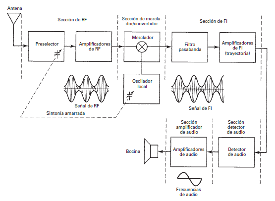
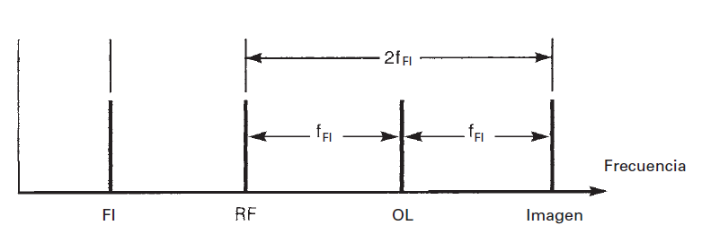

# Receptor Superheterodino
---
## Generalidades
---
Hay varios tipos de receptores, pero vamos a concentrar nuestro tiempo en estudiar el superheterodino que es el mas común. El `heterodinar` viene de mezclar dos frecuencias o trasladar una de ellas utilizando un dispositivo no lineal. Esta va a ser la idea principal de este receptor. Podemos representar este receptor en los siguientes bloques:

Se ven en el diagrama varias etapas bien definidas que consisten en:

- **Sección de RF:** consiste en una etapa preselectora y una amplificadora, ya sea en un circuito o en varios. El preselector es un filtro pasa banda con frecuencia central regulable y tiene la función de limitar el ancho de banda de entrada lo suficiente para al menos rechazar una frecuencia particular y problemática llamada `frecuencia imagen`. Define la selectividad del receptor de acuerdo a la calidad del filtro. La etapa de amplificadores de RF (puede ser uno o varios) es la primer etapa activa del receptor y es la principal responsable del ruido que pueda ingresar al receptor además de definir la sensibilidad del equipo de acuerdo al nivel de ganancia que tenga.
- **Sección de mezclador/convertidor:** aparece en esta sección un oscilador local, conformado con cualquier circuito oscilador que satisfaga las necesidades. La particularidad que tiene es que la frecuencia del oscilador depende de la frecuencia sintonizada en el preselector. Esto tiene el propósito de que, al entrar la AM y la señal del oscilador local al mezclador, se produzca como resultado una AM con el mismo ancho de banda e información, pero con una portadora de menor frecuencia que llamamos `FI` (de `frecuencia intermedia`) que suele ser 455 KHz. Esto se hace para que el trabajo de filtrado sea mas sencillo por el uso de frecuencias mas bajas.
- **Sección de FI:** esta etapa comienza con un filtro pasa banda, centrado en la `FI` para solo dejar pasar a los amplificadores la mezcla de señales que den como resultado una AM con portadora igual a `FI`, ya que el mezclador produce una serie de combinaciones de frecuencias que no son las que necesita el receptor. Luego esta señal pasa por una serie de amplificadores para subir la amplitud. Es normal ver varios amplificadores de `FI` porque son mucho más fáciles de construir que los de `RF` que tiene frecuencias más elevadas.
- **Sección de detector:** la función de este bloque es regresar la señal de AM a la información original de audio. Consiste en algún circuito que pueda demodular la AM y separar la portadora de la moduladora, rescatando la última. El circuito puede ser tan simple como un diodo con un capacitor.
- **Sección de audio:** consiste en una serie de amplificadores de audio en cascada con la suficiente ganancia para poder trabajar con los parlantes o la carga que tenga el receptor.

## Frecuencia Imagen y Oscilador Local
---
Un tema no poco relevante en este tipo de circuitos es lo que se conoce como la `frecuencia imagen`. Supongamos lo siguiente:

Se sintoniza un receptor superheterodino a la frecuencia de 2 MHz. Su `frecuencia intermedia` se sabe que es 455 KHz y el `oscilador local` es de `inyección lateral superior`.

Bajo estas condiciones, el espectro de frecuencias nos quedaría algo así:

Donde:
- `FI` es la frecuencia intermedia (455 KHz).
- `RF` es la frecuencia sintonizada (1 MHz).
- `OL` es la frecuencia del oscilador local (noten que se encuentra por arriba de la sintonizada, de ahí que es de inyección lateral superior).
- `Imagen` es la frecuencia imagen.

Noten que la particularidad es que la frecuencia imagen es una frecuencia que se encuentra a igual distancia de la del oscilador local que la sintonizada. Si el ancho de banda es lo suficientemente grande, el problema es que corremos riesgo de que esa frecuencia imagen entre al receptor, y al mezclarse con el oscilador local, produzca una frecuencia intermedia válida.

O sea que:

$$
FI = F_{OL} - F_{RF}
$$

$$
FI = F_{im} - F_{OL}
$$

En el caso de que el oscilador local sea de inyección lateral inferior, la frecuencia imagen y la sintonizada cambian de lugar en el espectro, ya que el oscilador local esta por debajo de la sintonizada y tiene que mantener una distancia igual a FI para ambas. Entonces, en este caso:

$$
FI = F_{RF} - F_{OL}
$$

$$
FI = F_{OL} - F_{im}
$$

Resumiendo, la `frecuencia imagen` es una frecuencia distinta a la que se sintonizó, pero que al mezclarse con el oscilador local, también produce una frecuencia intermedia válida para el receptor.

La solución a esto es asegurarnos que el ancho de banda de entrada al receptor sea capaz de rechazar esta frecuencia imagen. Como la frecuencia sintonizada esta a una distancia de dos veces la frecuencia intermedia, podemos decir que el ancho de banda máximo que necesitamos es:

$$
\Delta F_{max} = 2 FI
$$